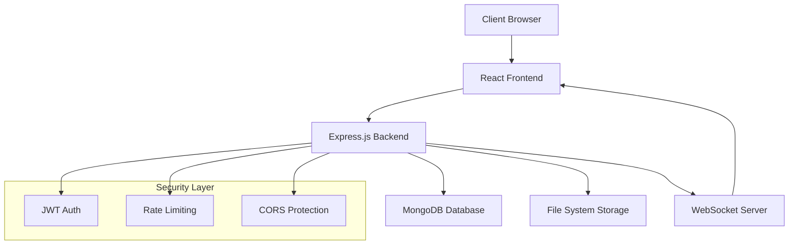

## 🖥️ Configuração do Servidor Windows para Acesso Público

### 1. **Configurar o Backend para Escutar em Todas as Interfaces**

**backend/server.js** - Atualizar configuração:

```javascript
const PORT = process.env.PORT || 5000;
const HOST = process.env.HOST || '0.0.0.0'; // IMPORTANTE: escutar em todas as interfaces

// ... resto da configuração

server.listen(PORT, HOST, () => {
  console.log(`🚀 Servidor KPCloud a correr em http://${HOST}:${PORT}`);
  console.log(`🌐 Acesso público: http://SEU_IP_PUBLICO:${PORT}`);
  console.log('📍 Rotas disponíveis:');
  console.log('  - GET  /');
  console.log('  - POST /api/auth/register');
  console.log('  - POST /api/auth/login');
  console.log('  - GET  /api/auth/profile');
  console.log('  - GET  /api/health');
});
```


### 2. **Configurar Variáveis de Ambiente**

**backend/.env**:

```env
# Configuração para acesso público
HOST=0.0.0.0
PORT=5000
FRONTEND_URL=http://SEU_IP_PUBLICO:3000

# Permitir CORS para IP público
CORS_ORIGIN=http://SEU_IP_PUBLICO:3000,http://localhost:3000

# Outras configurações
MONGODB_URI=mongodb://127.0.0.1:27017/kpcloud
JWT_SECRET=your-super-secret-jwt-key
UPLOAD_PATH=C:\KPCloudStorage
```


### 3. **Configurar Frontend para Produção**

**src/services/api.js** - Configuração dinâmica:

```javascript
// Detectar ambiente automaticamente
const getAPIBaseURL = () => {
  if (process.env.NODE_ENV === 'production') {
    // Em produção, usar IP do servidor atual
    const currentHost = window.location.hostname;
    return `http://${currentHost}:5000/api`;
  }
  
  // Em desenvolvimento
  return process.env.REACT_APP_API_URL || 'http://localhost:5000/api';
};

const api = axios.create({
  baseURL: getAPIBaseURL(),
  timeout: 30000,
  headers: {
    'Content-Type': 'application/json',
  },
});
```


### 4. **Configurar Firewall do Windows**

#### Opção A: Via Interface Gráfica

```bash
# 1. Abrir "Windows Defender Firewall com Segurança Avançada"
# 2. Clicar em "Regras de Entrada"
# 3. Clicar em "Nova Regra..."
# 4. Selecionar "Porta" > Próximo
# 5. Selecionar "TCP" > Portas Específicas Locais: 3000,5000
# 6. Selecionar "Permitir a conexão"
# 7. Aplicar a todos os perfis (Domínio, Privado, Público)
# 8. Nome: "KPCloud - Portas 3000 e 5000"
```


#### Opção B: Via PowerShell (Como Administrador)

```powershell
# Abrir portas para KPCloud
New-NetFirewallRule -DisplayName "KPCloud Frontend" -Direction Inbound -Protocol TCP -LocalPort 3000 -Action Allow
New-NetFirewallRule -DisplayName "KPCloud Backend" -Direction Inbound -Protocol TCP -LocalPort 5000 -Action Allow

# Verificar se as regras foram criadas
Get-NetFirewallRule -DisplayName "*KPCloud*"
```


### 5. **Descobrir seu IP Público**

```powershell
# Método 1: PowerShell
Invoke-RestMethod -Uri "https://api.ipify.org?format=json"

# Método 2: Via CMD
curl https://api.ipify.org

# Método 3: Via browser
# Aceder a https://whatismyipaddress.com/
```


### 6. **Script de Deployment Automático**

**deploy-windows.bat**:

```batch
@echo off
echo 🚀 Iniciando deployment do KPCloud...

REM Obter IP público
echo 🌐 Obtendo IP público...
for /f "tokens=*" %%a in ('curl -s https://api.ipify.org') do set PUBLIC_IP=%%a
echo IP Público detectado: %PUBLIC_IP%

REM Configurar backend
echo ⚙️ Configurando backend...
cd backend
copy .env.example .env
powershell -Command "(gc .env) -replace 'FRONTEND_URL=.*', 'FRONTEND_URL=http://%PUBLIC_IP%:3000' | Out-File -encoding ASCII .env"
powershell -Command "(gc .env) -replace 'HOST=.*', 'HOST=0.0.0.0' | Out-File -encoding ASCII .env"

REM Instalar dependências
echo 📦 Instalando dependências do backend...
npm install

REM Configurar frontend
echo ⚙️ Configurando frontend...
cd ../frontend
echo REACT_APP_API_URL=http://%PUBLIC_IP%:5000/api > .env.production.local

REM Instalar dependências
echo 📦 Instalando dependências do frontend...
npm install

echo ✅ Deployment configurado!
echo 🌐 Frontend: http://%PUBLIC_IP%:3000
echo 🔧 Backend: http://%PUBLIC_IP%:5000
echo 📝 Para iniciar: execute start-kpcloud.bat

pause
```

**start-kpcloud.bat**:

```batch
@echo off
echo 🚀 Iniciando KPCloud...

REM Iniciar MongoDB (se não estiver como serviço)
echo 📊 Verificando MongoDB...
sc query MongoDB >nul 2>&1
if %errorlevel% neq 0 (
    echo Iniciando MongoDB...
    start "MongoDB" cmd /k "mongod --dbpath C:\data\db"
    timeout /t 5
)

REM Iniciar Backend
echo 🔧 Iniciando Backend...
start "KPCloud Backend" cmd /k "cd backend && npm start"

REM Aguardar backend iniciar
timeout /t 10

REM Iniciar Frontend
echo 🎨 Iniciando Frontend...
start "KPCloud Frontend" cmd /k "cd frontend && npm start"

echo ✅ KPCloud iniciado!
echo 🌐 Acesse: http://localhost:3000 (local) ou http://SEU_IP_PUBLICO:3000 (público)
```


### 7. **Configuração de Proxy Reverso com IIS (Opcional)**

Se quiser usar porta 80 (HTTP padrão):

**web.config** para IIS:

```xml
<?xml version="1.0" encoding="UTF-8"?>
<configuration>
    <system.webServer>
        <rewrite>
            <rules>
                <!-- Proxy para Frontend -->
                <rule name="Frontend" stopProcessing="true">
                    <match url="^(?!api/)(.*)" />
                    <action type="Rewrite" url="http://localhost:3000/{R:1}" />
                </rule>
                
                <!-- Proxy para Backend API -->
                <rule name="Backend API" stopProcessing="true">
                    <match url="^api/(.*)" />
                    <action type="Rewrite" url="http://localhost:5000/api/{R:1}" />
                </rule>
            </rules>
        </rewrite>
    </system.webServer>
</configuration>
```


### 8. **Verificação e Testes**

**test-connection.ps1**:

```powershell
# Script para testar conectividade
param(
    [string]$PublicIP = (Invoke-RestMethod -Uri "https://api.ipify.org?format=text")
)

Write-Host "🧪 Testando conectividade do KPCloud..." -ForegroundColor Green
Write-Host "IP Público: $PublicIP" -ForegroundColor Yellow

# Testar Backend
try {
    $backend = Invoke-RestMethod -Uri "http://${PublicIP}:5000/api/health" -TimeoutSec 10
    Write-Host "✅ Backend: Funcionando" -ForegroundColor Green
    Write-Host "   Status: $($backend.status)" -ForegroundColor Gray
} catch {
    Write-Host "❌ Backend: Erro de conexão" -ForegroundColor Red
    Write-Host "   Erro: $($_.Exception.Message)" -ForegroundColor Gray
}

# Testar Frontend
try {
    $frontend = Invoke-WebRequest -Uri "http://${PublicIP}:3000" -TimeoutSec 10 -UseBasicParsing
    Write-Host "✅ Frontend: Funcionando" -ForegroundColor Green
    Write-Host "   Código: $($frontend.StatusCode)" -ForegroundColor Gray
} catch {
    Write-Host "❌ Frontend: Erro de conexão" -ForegroundColor Red
    Write-Host "   Erro: $($_.Exception.Message)" -ForegroundColor Gray
}

# Testar portas
Write-Host "`n🔍 Testando portas..." -ForegroundColor Blue
Test-NetConnection -ComputerName $PublicIP -Port 3000
Test-NetConnection -ComputerName $PublicIP -Port 5000
```


### 9. **Configuração de Serviço Windows (Produção)**

**install-service.ps1** (Executar como Administrador):

```powershell
# Instalar Node.js Windows Service
npm install -g node-windows

# Criar serviço para Backend
$service = @"
var Service = require('node-windows').Service;

var svc = new Service({
  name:'KPCloud Backend',
  description: 'KPCloud Backend Service',
  script: 'C:\\caminho\\para\\seu\\projeto\\backend\\server.js',
  env: [
    {
      name: "NODE_ENV",
      value: "production"
    },
    {
      name: "HOST", 
      value: "0.0.0.0"
    }
  ]
});

svc.on('install',function(){
  svc.start();
});

svc.install();
"@

$service | Out-File -FilePath "install-backend-service.js" -Encoding ASCII
node install-backend-service.js
```


### 10. **Checklist Final**

- [ ] ✅ Backend configurado para `HOST=0.0.0.0`
- [ ] ✅ Firewall configurado (portas 3000, 5000)
- [ ] ✅ IP público descoberto
- [ ] ✅ Frontend apontando para IP público
- [ ] ✅ MongoDB a correr
- [ ] ✅ Testes de conectividade passou
- [ ] ✅ CORS configurado corretamente


### 🌐 **Acesso Final**

Após todas as configurações:

- **Frontend**: `http://SEU_IP_PUBLICO:3000`
- **Backend API**: `http://SEU_IP_PUBLICO:5000/api`
- **Health Check**: `http://SEU_IP_PUBLICO:5000/api/health`


### ⚠️ **Considerações de Segurança**

```bash
# 1. Usar HTTPS em produção
# 2. Configurar rate limiting mais restritivo
# 3. Usar reverse proxy (nginx/IIS)
# 4. Configurar backup automático
# 5. Monitorizar logs de acesso
```

Agora o teu KPCloud está acessível publicamente via IP! 🚀

<div style="text-align: center">⁂</div>

[^1]: https://pt.stackoverflow.com/questions/384017/como-abrir-um-servidor-local-usando-node

[^2]: https://www.luiztools.com.br/post/deploy-de-aplicacao-node-js-na-digital-ocean/

[^3]: https://saveincloud.com/pt/blog/web-aplicacao/configuracao-servidor-dotnet-no-windows/

[^4]: https://www.youtube.com/watch?v=tgFViGwOJhQ

[^5]: https://stackoverflow.com/questions/5489956/how-could-others-on-a-local-network-access-my-nodejs-app-while-its-running-on

[^6]: https://learn.microsoft.com/pt-br/aspnet/web-forms/overview/deployment/configuring-server-environments-for-web-deployment/configuring-a-web-server-for-web-deploy-publishing-web-deploy-handler

[^7]: https://www.devmedia.com.br/construindo-um-servidor-web-com-node-js/32023

[^8]: https://www.reddit.com/r/node/comments/g7pnf4/how_can_i_access_my_nodejs_server_thats_running/?tl=pt-br

[^9]: https://www.youtube.com/live/163jmMqvGmY

[^10]: https://cursos.alura.com.br/forum/topico-publicar-o-projeto-no-servidor-vps-199386


# 📁 KPCloud - Your Personal Home Cloud Solution

<div align="center">


**🏠 Transform your home server into a powerful cloud storage solution**

[
[
[
[

[
[
[
[

[🚀 Quick Start](#quick-start) - 
[📖 Documentation](./Docs) - 
[🐛 Report Bug](../../issues) - 
[💡 Request Feature](../../issues) - 
[💬 Discussions](../../discussions)

</div>

---

## 🌟 Overview

**KPCloud** is a modern, self-hosted cloud storage solution designed to run on your home server. Take control of your data with enterprise-grade features in a user-friendly interface that rivals commercial cloud services like Google Drive, Dropbox, and OneDrive.

### ✨ Why KPCloud?

- **🔒 Complete Privacy**: Your data stays on YOUR server
- **💰 Zero Monthly Fees**: No subscription costs
- **🏠 Home Server Optimized**: Designed for Raspberry Pi, NAS, and home servers
- **🌐 Web-Based Interface**: Access from any device with a web browser
- **📱 Mobile Responsive**: Works perfectly on phones and tablets
- **🔧 Easy Setup**: Get running in under 10 minutes

---

## 🎯 Key Features

<table>
<tr>
<td width="50%">

### 📂 File Management
- **Drag & Drop Upload** with progress tracking
- **Folder Organization** with custom colors
- **Bulk Operations** (select, move, delete)
- **File Preview** for images, videos, documents
- **Advanced Search** with filters
- **Trash/Recycle Bin** with restore functionality

### 👥 Collaboration
- **File Sharing** with expiration dates
- **User Management** with role-based access
- **Real-time Notifications** via WebSocket
- **Comment System** on files and folders
- **Activity Logs** for audit trails

</td>
<td width="50%">

### 🛡️ Security & Admin
- **JWT Authentication** with secure sessions
- **Admin Dashboard** for system configuration
- **Storage Quota Management** per user
- **Configurable Storage Paths** 
- **Rate Limiting** and DDoS protection
- **GDPR Compliance** tools

### 🎨 User Experience
- **Dark/Light Theme** toggle
- **Multi-language Support** (PT, EN, ES)
- **Responsive Design** for all devices
- **Keyboard Shortcuts** for power users
- **Customizable Interface** with user preferences

</td>
</tr>
</table>

---

## 📸 Screenshots

<div align="center">

### 🎨 Modern Interface


### 📱 Mobile Responsive


### 🔧 Admin Panel


</div>

---

## 🚀 Quick Start

### Prerequisites

Before installing KPCloud, ensure you have:

- **Node.js** 18.0.0 or higher
- **MongoDB** 6.0 or higher
- **Git** for cloning the repository
- **4GB RAM** minimum (8GB recommended)
- **10GB** free storage space


### ⚡ One-Line Installation

```bash
curl -fsSL https://raw.githubusercontent.com/yourusername/kpcloud/main/install.sh | bash
```


### 🐳 Docker Installation (Recommended)

```bash
# Clone the repository
git clone https://github.com/yourusername/kpcloud.git
cd kpcloud

# Start with Docker Compose
docker-compose up -d

# Access KPCloud at http://localhost:3000
```


### 🔧 Manual Installation

<details>
<summary>Click to expand manual installation steps</summary>

#### 1. Clone Repository
```bash
git clone https://github.com/yourusername/kpcloud.git
cd kpcloud
```

#### 2. Backend Setup
```bash
cd backend
npm install
cp .env.example .env
# Edit .env with your configuration
npm start
```

#### 3. Frontend Setup
```bash
cd ../frontend
npm install
npm start
```

#### 4. Database Setup
```bash
# Make sure MongoDB is running
mongod --dbpath /your/db/path

# The application will create collections automatically
```

</details>

---

## ⚙️ Configuration

### Environment Variables

Create a `.env` file in the backend directory:

```env
# Server Configuration
PORT=5000
NODE_ENV=production
FRONTEND_URL=http://localhost:3000

# Database
MONGODB_URI=mongodb://localhost:27017/kpcloud

# Security
JWT_SECRET=your-super-secret-jwt-key
ADMIN_EMAIL=admin@yourdomain.com

# Storage Configuration
UPLOAD_PATH=/path/to/your/storage
MAX_FILE_SIZE=100MB
USER_QUOTA=10GB

# Optional: Email Configuration
SMTP_HOST=smtp.gmail.com
SMTP_PORT=587
SMTP_USER=your-email@gmail.com
SMTP_PASS=your-app-password
```


### 🎛️ Admin Configuration

1. **First User**: The first registered user automatically becomes admin
2. **Storage Path**: Configure where files are stored via admin panel
3. **User Quotas**: Set individual or global storage limits
4. **API Endpoints**: Configure custom API URLs for distributed setups

---

## 🏗️ Architecture

<div align="center">



</div>

### 🧱 Tech Stack

| Component | Technology | Purpose |
| :-- | :-- | :-- |
| **Frontend** | React 18, Material-UI | Modern, responsive user interface |
| **Backend** | Node.js, Express.js | RESTful API and business logic |
| **Database** | MongoDB | User data, file metadata, settings |
| **Authentication** | JWT + bcrypt | Secure user authentication |
| **File Storage** | Local File System | Configurable storage location |
| **Real-time** | Socket.io | Live notifications and updates |


---

## 📚 API Documentation

<details>
<summary>🔗 Authentication Endpoints</summary>

```javascript
// Register new user
POST /api/auth/register
{
  "name": "John Doe",
  "email": "john@example.com",
  "password": "securepassword"
}

// Login
POST /api/auth/login
{
  "email": "john@example.com",
  "password": "securepassword"
}

// Get profile
GET /api/auth/profile
Headers: Authorization: Bearer <token>
```

</details>
<details>
<summary>📁 File Management Endpoints</summary>

```javascript
// Upload file
POST /api/files/upload
FormData: file, folderId (optional)

// Get files in folder
GET /api/files?folderId=<id>

// Move to trash
DELETE /api/files/:id

// Download file
GET /api/files/:id/download
```

</details>
<details>
<summary>🔧 Admin Endpoints</summary>

```javascript
// Get system settings (Admin only)
GET /api/settings

// Update storage configuration (Admin only)
PUT /api/settings
{
  "storage": {
    "basePath": "/new/storage/path",
    "maxFileSize": "100MB"
  }
}
```

</details>

---

## 🛠️ Development

### 🏃‍♂️ Running in Development Mode

```bash
# Backend (Terminal 1)
cd backend
npm run dev

# Frontend (Terminal 2)
cd frontend
npm start

# MongoDB (Terminal 3)
mongod --dbpath ./data/db
```


### 🧪 Testing

```bash
# Run backend tests
cd backend
npm test

# Run frontend tests
cd frontend
npm test

# Run integration tests
npm run test:integration
```


### 📝 Code Quality

```bash
# Lint code
npm run lint

# Format code
npm run format

# Type checking
npm run type-check
```


---

## 🐳 Docker Deployment

### Development with Docker

```yaml
# docker-compose.dev.yml
version: '3.8'
services:
  kpcloud-frontend:
    build:
      context: ./frontend
      dockerfile: Dockerfile.dev
    ports:
      - "3000:3000"
    volumes:
      - ./frontend:/app
      
  kpcloud-backend:
    build:
      context: ./backend
      dockerfile: Dockerfile.dev
    ports:
      - "5000:5000"
    environment:
      - NODE_ENV=development
    volumes:
      - ./backend:/app
      - storage-data:/storage
      
  mongodb:
    image: mongo:6.0
    ports:
      - "27017:27017"
    volumes:
      - mongo-data:/data/db

volumes:
  mongo-data:
  storage-data:
```


### Production Deployment

```bash
# Build production images
docker-compose -f docker-compose.prod.yml build

# Deploy to production
docker-compose -f docker-compose.prod.yml up -d

# Scale backend if needed
docker-compose -f docker-compose.prod.yml up -d --scale backend=3
```


---

## 🔒 Security

### 🛡️ Security Features

- **🔐 JWT Authentication** with secure token rotation
- **🚨 Rate Limiting** to prevent abuse
- **🛡️ Input Validation** on all endpoints
- **🔒 CORS Protection** for cross-origin requests
- **📝 Audit Logging** for administrative actions
- **🔑 Password Hashing** using bcrypt with salt


### 🏠 Home Server Security Best Practices

```bash
# 1. Use HTTPS with Let's Encrypt
sudo certbot --nginx -d yourdomain.com

# 2. Configure firewall
sudo ufw allow 80
sudo ufw allow 443
sudo ufw enable

# 3. Regular updates
sudo apt update && sudo apt upgrade
npm audit fix

# 4. Backup strategy
# Automated daily backups to external drive
0 2 * * * /home/user/scripts/backup-kpcloud.sh
```


---

## 📊 Performance \& Monitoring

### 📈 System Requirements

| Users | RAM | CPU | Storage | Bandwidth |
| :-- | :-- | :-- | :-- | :-- |
| 1-5 | 4GB | 2 cores | 100GB+ | 10 Mbps up |
| 5-25 | 8GB | 4 cores | 500GB+ | 25 Mbps up |
| 25-100 | 16GB | 8 cores | 2TB+ | 100 Mbps up |

### 🔍 Monitoring

```bash
# Health check endpoint
curl http://localhost:5000/api/health

# System stats
GET /api/admin/stats
{
  "users": 42,
  "files": 1337,
  "storage_used": "45.2 GB",
  "uptime": "15 days"
}
```


---

## 🤝 Contributing

We welcome contributions! Here's how you can help:

### 🎯 Ways to Contribute

- 🐛 **Report Bugs** via [GitHub Issues](../../issues)
- 💡 **Suggest Features** in [Discussions](../../discussions)
- 📝 **Improve Documentation**
- 🔧 **Submit Pull Requests**
- 🌍 **Add Translations**


### 🚀 Development Workflow

1. **Fork** the repository
2. **Create** a feature branch (`git checkout -b feature/amazing-feature`)
3. **Commit** your changes (`git commit -m 'feat: add amazing feature'`)
4. **Push** to the branch (`git push origin feature/amazing-feature`)
5. **Open** a Pull Request

### 📋 Commit Convention

We use [Conventional Commits](https://www.conventionalcommits.org/):

```bash
feat: add user profile management
fix: resolve file upload timeout issue
docs: update API documentation
style: improve responsive design
refactor: optimize database queries
test: add integration tests for auth
```


---

## 📄 License

This project is licensed under the **MIT License** - see the [LICENSE](LICENSE) file for details.

```
MIT License

Copyright (c) 2025 KPCloud Contributors

Permission is hereby granted, free of charge, to any person obtaining a copy
of this software and associated documentation files (the "Software"), to deal
in the Software without restriction, including without limitation the rights
to use, copy, modify, merge, publish, distribute, sublicense, and/or sell
copies of the Software...
```


---

## 🙏 Acknowledgments

- **Inspiration**: Google Drive, Nextcloud, Dropbox
- **Icons**: [Material-UI Icons](https://mui.com/material-ui/material-icons/)
- **Contributors**: All the amazing people who help improve KPCloud
- **Community**: Our users who provide feedback and support

---

## 📞 Support \& Community

<div align="center">

### Get Help & Stay Connected

[
[
[

### Support the Project

[
[

</div>

---

## 🗺️ Roadmap

### 🎯 Current Version (v1.0)

- ✅ Core file management
- ✅ User authentication
- ✅ Admin panel
- ✅ Mobile responsive design


### 🚧 Coming Soon (v1.1)

- 📱 **Mobile Apps** (iOS \& Android)
- 🔄 **File Synchronization**
- 📊 **Advanced Analytics**
- 🎥 **Video Streaming**


### 🔮 Future Plans (v2.0)

- 🤖 **AI-Powered Search**
- 🔗 **Third-party Integrations**
- 📋 **Office Suite Integration**
- 🌐 **Multi-server Clustering**

---

<div align="center">

**⭐ If KPCloud helps you, please consider giving it a star!**

[

---

Made with ❤️ by the KPCloud community

[🔝 Back to Top](#-kpcloud---your-personal-home-cloud-solution)

</div>
